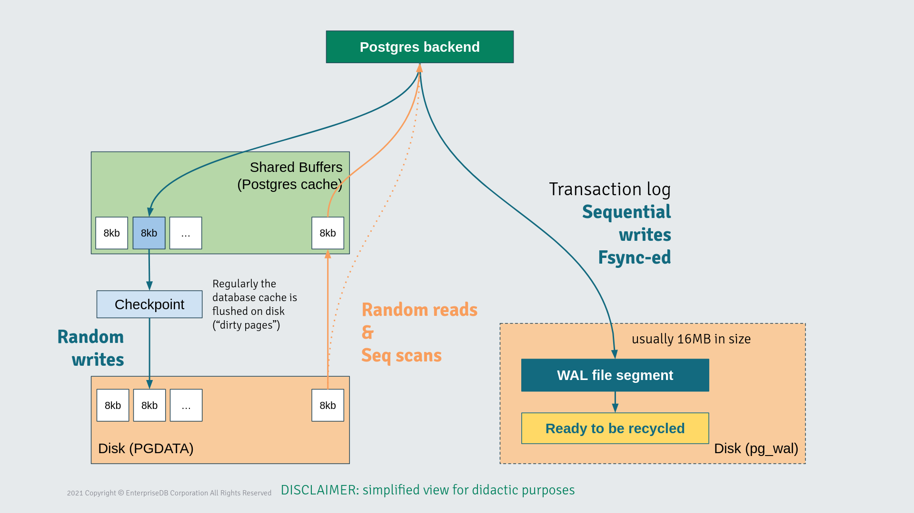

# PostgreSQL Database

PostgreSQL is a powerful, open source object-relational database system with over 35 years of
active development that has earned it a strong reputation for reliability, feature robustness,
and performance. Source: https://www.postgresql.org/

## Storage Impact

PostgreSQL's I/O operations come in all flavours:

* **Sequential Writes** - writing WAL files on disk
* **Random Writes** - flushing data from memory buffer to disk
* **Sequential Reads** - accessing table with a sequential scan
* **Random Reads** - accessing table with an index scan

Every operation works on memory blocks of 8Kb. Postgres accesses these blocks from either the RAM
or the storage, delegating the operation to the underlying Operating System, making it storage
agnostic.



## Benchmarking PostgreSQL

The following instructions are here to help you gather **baselines** of the I/O operations performance.
This is required to make informed decisions on your architecture, by comparing results obtained with
different setups and configurations of your Kubernetes system (e.g. sotrageClass, CSI, disks).

**Do not use these results as absolute values.**

Postgres has its own tools to run performance tests:

* `pgbench` - an executable to run custom or TPC tests against a database. Results are in TPS (transaction per second)
* `pg_test_fsync` - an executable to flush data on disk using different syscall (e.g. `fsync`, `fdatasync`)

Although they are pretty useful to collect numbers of your system, they don't actually say much
about the underlying storage. That is why is recommended to first take baselines using storage
benchmarking tools like FIO. You can find FIO tool instructions in the [../common/README.md file](../common/README.md)
of this project.

### Pre-Requisites

1. Ensure the deployment of both FIO and PostgreSQL resources are in the right node that exposes the
storage we want to test. In order to do that, consider creating taints on the target node and add
tolerations on the resources to force the scheduler to deploy them on that node.

    Example:
    ```shell
    # Label nodes
    kubectl label nodes <node-name> node-role.kubernetes.io/postgres=""
    
    # Taint nodes
    kubectl taint node <node-name> node-role.kubernetes.io/postgres=:NoSchedule
    ```

2. Collect the amount of RAM and CPU resources exposed in the target node to properly set the
PostgreSQL configuration.

### FIO Benchmark

To ensure the Storage Class is behaving correctly for a PostgreSQL workload, you need to create
four different FIO `configMaps` — one for each PostgreSQL specific I/O operation. This directory
contains base `configMaps` that you can use to simulate PostgreSQL workloads or customize them to
best fit your use case.

Please, refer to the FIO section in the `README.md` of the [../common/](../common) directory in this
project to learn how to deploy FIO tests in your Kubernetes environment.

### `pgbench` Benchmark

https://www.postgresql.org/docs/current/pgbench.html

This tool aims to give an idea of how many transactions per second (TPS) a PostgreSQL system can
achieve. By default, it will exec a [TPC-b (sort of) test](https://www.postgresql.org/docs/current/pgbench.html#TRANSACTIONS-AND-SCRIPTS)
on a database previously initialized by `pgbench` itself. You can also run customized test script
to collect TPS for your own database schema. In this guide we will take baselines by using the
default TPC-b-like test.

To actually run `pgbench` you need to have a PostgreSQL database deployed in your Kubernetes.
`pgbench` will then connect to the PostgreSQL endpoint and issue its own commands. In this example
we will deploy PostgreSQL with [CloudNativePG](https://cloudnative-pg.io/).

Follow the instructions to install CloudNativePG at this link:
https://cloudnative-pg.io/documentation/current/installation_upgrade/

The CloudNativePG Operator offers a way to natively run PostgreSQL on Kubernetes, by allowing us to
declaratively set many configuration aspects of a PostgreSQL Cluster, using the `Cluster` Custom
Resource Definition (CRD).

Example with explanatory comments:

```yaml
apiVersion: postgresql.cnpg.io/v1
kind: Cluster
metadata:
  name: benchmark-pg
  namespace: benchmark
spec:
  # Number of PostgreSQL instances ( n>=2 means one primary and n-1 standbys)
  instances: 1
  imageName: 'ghcr.io/cloudnative-pg/postgresql:17.2'

  # Could be useful to have metrics exported in a Prometheus instance
  monitoring:
    enablePodMonitor: true

  # Use the same resources on every test for comparison purpose
  # You can keep them low, as we are testing disks not overall node performances
  resources:
    limits:
      cpu: '4'
      memory: 16Gi
    requests:
      cpu: '4'
      memory: 16Gi

  # To ensure the pod is scheduled on the target node
  affinity:
    tolerations:
      - effect: NoSchedule
        key: node-role.kubernetes.io/postgres
        operator: Equal
    enablePodAntiAffinity: true
    podAntiAffinityType: required
    topologyKey: kubernetes.io/hostname

  # PostgreSQL settings section
  postgresql:
    parameters:
      work_mem: 4MB
      maintenance_work_mem: 1GB
      effective_cache_size: 16GB
      # shared_buffers must be less than the total amount of RAM (usually 50%)
      shared_buffers: 8GB
      # In case of SSDs:
      effective_io_concurrency: '4'

  # Storage section
  # Separate WAL files from data directory to isolate different I/O operations
  walStorage:
    size: 50Gi
    # The storageClass to test
    storageClass: <storage-class-name>
  storage:
    # The data directory must contain a database larger than at least 4 times the amount of RAM
    size: 300Gi
    # The storageClass to test (can be different from the walStorage)
    storageClass: <storage-class-name>
```

#### Phase 1: initialization

The TPC-b test requires a database with specific tables to write into.
This is done by the initialization phase of `pgbench` with the following command:

```shell
pgbench -i -s <scale-factor> 
```
where `<scale-factor>` is the value that sets the size of the DB (indexes included),
following this formula: `(0.0669 * DB_SIZE * 1024) - 0.5`.

For example, to get a ~200GB database size, you set the scale factor to: 13700.

The resulting Kubernetes resources will be:

```yaml
apiVersion: batch/v1
kind: Job
metadata:
  labels:
    benchmark: pgbench
  name: pgbench-init
  namespace: benchmark
spec:
  template:
    metadata:
      labels:
        benchmark: pgbench
    spec:
      containers:
      # Initialize the DB with a scale factor of 13700 (~200GB)
      - args:
        - -i
        - -s
        - "13700"
        command:
        - pgbench
        # Environment variable to connect to the CNPG database
        env:
        - name: PGHOST
          value: benchmark-pg-rw
        - name: PGDATABASE
          value: app
        - name: PGPORT
          value: "5432"
        - name: PGUSER
          valueFrom:
            secretKeyRef:
              key: username
              name: benchmark-pg-app
        - name: PGPASSWORD
          valueFrom:
            secretKeyRef:
              key: password
              name: benchmark-pg-app
        image: ghcr.io/cloudnative-pg/postgresql:17.2
        imagePullPolicy: Always
        name: pgbench

      restartPolicy: Never
```

Once the job is done, you can recover the timing from the logs of the pod:

```shell
kubectl logs -n benchmark <pgbench-init-pod-name> | tail -n 20 > pgbench-init.log
```

#### Phase 2: running test

The actual benchmark execution is triggered with the following `pgbench` command:

```shell
pgbench -t <time> -c <clients> -j <jobs>
```
where:

* `<time>` is the time in seconds the test must last
* `<clients>` is the amount of concurrent client sessions opened to the database
* `<jobs>` is the amount of processes spawned by the `pgbench` to parallelize the benchmark

Therefore, the Kubernetes resources should be like the following:

```yaml
apiVersion: batch/v1
kind: Job
metadata:
  labels:
    benchmark: pgbench
  name: pgbench-run
  namespace: benchmark
spec:
  template:
    metadata:
      labels:
        benchmark: pgbench
    spec:
      containers:
      - args:
        - --time
        - "<time>"
        - --client
        - "<clients>"
        - --jobs
        - "<jobs>"
        command:
        - pgbench
        # Environment variable to connect to the CNPG database
        env:
        - name: PGHOST
          value: benchmark-pg-rw
        - name: PGDATABASE
          value: app
        - name: PGPORT
          value: "5432"
        - name: PGUSER
          valueFrom:
            secretKeyRef:
              key: username
              name: benchmark-pg-app
        - name: PGPASSWORD
          valueFrom:
            secretKeyRef:
              key: password
              name: benchmark-pg-app
        image: ghcr.io/cloudnative-pg/postgresql:17.2
        imagePullPolicy: Always
        name: pgbench

      restartPolicy: Never
```

Once the test is done, collect the results from the log:

```shell
kubectl logs -n benchmark <pgbench-run-pod-name> | tail -n 20 > pgbench.log
```

### `pg_test_fsync` Benchmark

https://www.postgresql.org/docs/current/pgtestfsync.html

The `pg_test_fsync` tool helps determine the fastest sync method for flushing WAL files into disk,
between the available ones in the host Operating System. In this guide we will use it to gather
baselines of the maximum throughput to be compared between different storage choices.

This command has only 2 parameters as arguments:

```shell
pg_test_fsync -f <file-name> -s <time>
```
where:

* `<file-name>` is the test file to write on the target path
* `<time>` is the time in seconds each test should last

We will run it by creating a Kubernetes Job that will schedule the Pod in the target node using the
previously created PVC with the target `storageClass` we want to test.

Example of the PVC:

```yaml
apiVersion: v1
kind: PersistentVolumeClaim
metadata:
  labels:
    benchmark: pgFsync
  name: fsync-wal-pvc
  namespace: benchmark
spec:
  accessModes:
  - ReadWriteOnce
  resources:
    requests:
      # Define how large the pvc should be: e.g. 1Gi
      storage: <pvc-size>
  storageClassName: <storage-class-name>
```

Example of the `pg_test_fsync` Job:

```yaml
apiVersion: batch/v1
kind: Job
metadata:
  labels:
    benchmark: pgFsync
  name: pg-fsync-test
  namespace: benchmark
spec:
  template:
    metadata:
      labels:
        benchmark: pgFsync
    spec:

     ## In case nodes are reserved to run just PostgreSQL workloads, they should be tainted.
     ## To schedule this pod on the target nodes you need tolerations:
     #
     # tolerations:
     #   - key: "node-role.kubernetes.io/postgres"
     #     operator: "Equal"
     #     effect: "NoSchedule"
     ##
     ## To prevent scheduling this pod on a node different from the target one, you can use the Affinity:
     #
     # affinity:
     #   podAntiAffinity:
     #     requiredDuringSchedulingIgnoredDuringExecution:
     #       - labelSelector:
     #           matchExpressions:
     #             - key: benchmark
     #               operator: In
     #               values:
     #                 - pgFsync
     #         topologyKey: kubernetes.io/hostname
     #
     ## Or you can use a node selector as well:
     ##
     # nodeSelector:
     #   kubernetes.io/hostname: "<node-name>"

      containers:
      # For example: run each test for 30 seconds against the /wal/fsync-test-file file
      - args:
        - -f
        - "/wal/fsync-test-file"
        - -s
        - "30"
        command:
        - pg_test_fsync
        image: ghcr.io/cloudnative-pg/postgresql:17.2
        imagePullPolicy: Always
        name: fsync-test
        volumeMounts:
          - mountPath: /wal
            name: wal

      # Specify the PVC to use
      volumes:
        - name: wal
          persistentVolumeClaim:
            claimName: fsync-wal-pvc

      restartPolicy: Never
```

Once the test is done, collect the results from the pod's log:

```shell
kubectl logs -n benchmark <pg-fsync-test-pod-name> fsync-test
```
